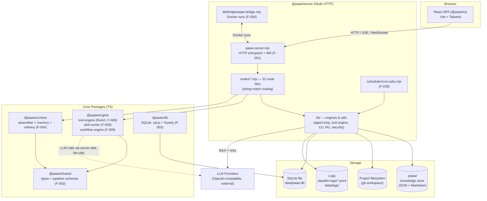
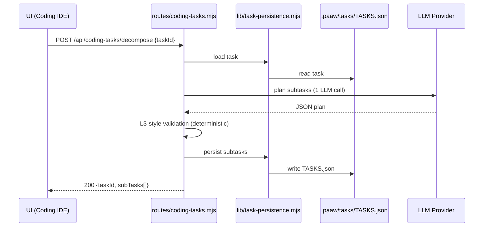

# Architecture

> Code Understanding architecture output — regenerated 2026-10-02 (W40) from actual source scan.
> Previous version (2026-07-13) was speculative and contained stale assumptions (Next.js, missing packages). This version reflects the real codebase.

## System Overview

PAAW (Personal AI Assistant Workspace) is a self-hosted AI agent platform built as an **npm workspaces monorepo**. It provides:

1. **Coding IDE** — file tree, editor, terminal, git panel, browser panel for developer + AI pair work
2. **Multi-agent infrastructure** — AI crews, A2A protocol, EM (Engineering Manager) orchestration, Night Shift autonomous mode
3. **Agent authoring** — skills, workflows, app builder, plugins, agentic bindings
4. **Project intelligence** — feature mapping, code intelligence, release unit analysis, security scanning, issue tracking

Core constraints (by design): no external database server (embedded SQLite), no Express/framework (raw Node HTTP), all project knowledge version-controlled in `.paaw/` (ADR-001).

## Repository Layout (6 npm packages)

> `packages/*` 目錄下有 8 個子目錄，但僅 6 個含 `package.json` 為 npm workspace；`data/` 與 `temp/` 是 runtime 資料/暫存目錄（無 `package.json`，非 workspace）。

```
tPAAW/                          # npm workspaces monorepo — "paaw" v1.0.0
├── packages/
│   ├── ui/                     # @paaw/ui — React 18 + Vite 5 + Tailwind CSS
│   ├── server/                 # @paaw/server — Node HTTP server, routes/, lib/, scheduler/, tools/
│   ├── engine/                 # @paaw/engine — TS tool engine (ReAct loop), skill runner, workflow engine
│   ├── context/                # @paaw/context — context assembler, memory store, refinery
│   ├── db/                     # @paaw/db — SQLite (sql.js + Kysely): connection, migrations, repositories
│   ├── shared/                 # @paaw/shared — shared types, typebox schemas, ID/utils
│   ├── data/                   # runtime data (app-data/, helpdesk/, llm-logs/, logs/) — no package.json, not a workspace
│   └── temp/                   # temp LLM/API-tester payload files — no package.json, not a workspace
├── scripts/                    # dev-server, pack, paaw-sync, postinstall, runtime-guard-scanner
├── tests/                      # vitest unit tests + Playwright e2e (tests/unit/, tests/e2e/)
└── .paaw/                      # file-based knowledge store (ADR-001) — see "Knowledge Layer"
```

**Stack facts** (verified from `package.json`):
- UI: React 18.3, Vite 5.4, Tailwind 3.4, ReactFlow (@xyflow/react), xterm.js, markmap — **not Next.js**
- Server: plain Node `http` module — **no Express/Koa/Fastify**; routing via string comparison on cleaned URL + `req.method`
- Tests: Vitest (unit) + Playwright (e2e)
- LLM: OpenAI-compatible providers via fetch with retry (F-010), logged to JSONL (ADR-010)

## High-Level Architecture (C4 Container View)



## Layers & Responsibilities

| # | Layer | Package(s) | Responsibility | Feature IDs |
|---|-------|-----------|----------------|-------------|
| 1 | Presentation | `@paaw/ui` | React SPA: coding IDE, chat, crew manager, EM dashboard, settings, i18n (zh/zh-mix/en/ja) | F-011..F-012, F-058, UI panels of most features |
| 2 | HTTP & Routing | `@paaw/server` (routes/, paaw-server.mjs) | Raw Node HTTP, 52 route files, WebSocket handler, EPIPE guard, crash logging | F-001 |
| 3 | Agent Runtime | `server/lib` + `@paaw/engine` | Agent loop (ReAct), tool engine (server + TS variants), tool registry, A2A protocol, crew execution | F-006, F-007, F-008, F-030, F-031 |
| 4 | Intelligence | `server/lib` | Code understanding (feature map, code/test/change intelligence), release unit model, security scan, doc coverage | F-016..F-020, F-028, F-060 |
| 5 | Orchestration | `server/lib` | EM sessions, auto dispatch, execution plans, night shift, overnight runner | F-023, F-024 |
| 6 | Context & Memory | `@paaw/context` + `server/lib` | Context assembly, memory store, compaction/truncation, agent memory | F-004, F-005, F-025, F-057 |
| 7 | Skill & Workflow | `@paaw/engine` | Skill runners (Prompt/Data/Api/Script), topological workflow execution | F-009, F-032, F-034 |
| 8 | Platform Services | `server/routes`, `scheduler/` | Apps, notes, helpdesk, projects, cron jobs, backup, logs, distill, mindmap, API tester | F-033, F-035..F-042, F-044..F-050 |
| 9 | Data | `@paaw/db` + `.paaw/` + filesystem | SQLite repositories (runs/chats/data store), file-based knowledge store | F-003, F-014 |
| 10 | Security | `server/lib/security/` | Policy pipeline, approvals, secret store, audit log, path safety | F-021, F-022 |

## Key Subsystems

### Agent Execution — two tool engines, one registry direction
- **F-007 Tool Engine (Server)** — `server/lib/tool-engine/` + `tools/index.mjs`: provider adapter, registry, write verification, security kernel integration
- **F-008 Engine Tool Engine (TS)** — `engine/src/tool-engine/` (index.ts, provider.ts, tool-registry.ts, types.ts): the "hidden CLI behind chat" — OpenAI-compatible tool-calling ReAct loop used by skill/app/chat runners
- Shared definitions flow through `tool-registry.mjs` (ADR-019, OCP-compliant registry); `tool-registry-init.mjs` bridges legacy loops during migration

### Request routing (raw Node, no framework)
Every route file exports a handler returning `true` if it consumed the request. Dispatch is sequential string matching, e.g.:

```js
if (cleanUrl !== "/api/coding-health") return false;
if (req.method !== "GET") return false;
```

Consequence: no middleware chain, no OpenAPI annotations — API truth lives in `.paaw/specs/api-contract.md` (regenerated this week, 236 method+path combinations).

### Knowledge Layer (.paaw/)
`.paaw/` is the canonical project knowledge store (ADR-001) — machine-parseable JSON + human-readable Markdown:

| Path | Content | Maintained by |
|------|---------|---------------|
| `features/FEATURES.json` | Feature↔File↔API↔Test map (62 features) | CU pipeline, L3 validator (ADR-015) |
| `issues/ISSUES.json` | Issue tracker | F-014 |
| `tasks/TASKS.json` | Task board & pipeline | F-015 |
| `code-intelligence/` | Symbol index, call/dependency graphs | F-017 |
| `security/scan-results.json` | Semgrep scan results | F-020 |
| `cu-status.json` | CU step freshness tracking | CU pipeline |
| `specs/`, `project/` | api-contract, error-codes, architecture (this file) | CU pipeline |
| `decisions/`, `sessions/`, `agent-memory/`, `action-log/` | ADRs, night-shift session logs, per-agent memory, cross-agent handoff | agents |

### LLM Integration
All LLM calls flow through `lib/llm-utils.mjs` (F-010): model resolution → sanitize → fetch with retry/backoff → streaming support. Every call is logged to `data/llm-logs/{date}.jsonl` with call IDs for pairing (ADR-010). Context injection (feature map, code intel, security) into agent prompts per ADR-012.

### Scheduler & Bridge
- `scheduler/cron-jobs.mjs` (F-039): cron CRUD + scheduled execution via agent loop, delivery to chat
- `lib/bridge/paaw-bridge.mjs` (F-056): container/Docker sync requests, diffs, approvals, tool proxy

## Data Flow Examples



Multi-agent orchestration follows the **Hybrid Deterministic+LLM pattern** (ADR-016): deterministic collection → single LLM planning call → deterministic A2A dispatch → deterministic reporting.

## Active Feature Index (62)

Full detail per feature: `.paaw/features/FEATURES.json` (F-001 through F-062). Summary groups:

- **Core runtime:** F-001 server core, F-002 shared schemas, F-003 SQLite layer, F-062 shell utils
- **Agent runtime:** F-006 agent loop, F-007 server tool engine, **F-008 TS tool engine (newer module)**, F-030 A2A, F-031 crews
- **Context & memory:** F-004 context engine, F-005 server context, F-025 agent memory, F-057 compaction
- **Intelligence:** F-016 feature mapping, F-017 code intelligence, F-018 release unit intelligence, F-019 release management, F-020 health, F-021 path safety, F-028 doc coverage, F-060 CU rescan
- **Orchestration:** F-023 EM dashboard, F-024 execution plans, F-015 task board
- **IDE:** F-011 chat, F-012 coding IDE, F-013 git panel, F-014 issues, F-026 handover, F-027 ops, F-029 tests page, F-059 cost attribution
- **Agent authoring:** F-009 skill/workflow engine, F-032 skills, F-034 workflow editor, F-033 apps, F-049 plugins/bindings, F-050 employee workspace
- **Platform apps:** F-035 notes, F-036 helpdesk, F-045 projects, F-044 mindmap, F-042 distill, F-047 vibe sessions, F-055 pocket/history
- **Ops & infra:** F-037 settings, F-038 system prompts, F-039 cron, F-040 backup, F-041 logs, F-043 browser session, F-048 API tester, F-056 bridge, F-061 build scripts
- **Mock/demo views:** F-051 orchestrator, F-052 ops dashboard, F-053 briefing player, F-054 project dashboard/ADR viewer

## Key Design Decisions (ADR digest)

Full records: `.paaw/decisions/` and `DECISIONS.md`. Most architecture-shaping:

| ADR | Decision | Why it matters here |
|-----|----------|---------------------|
| ADR-001 | File-based knowledge store (`.paaw/`) | No DB for knowledge; JSON/MD, version-controlled |
| ADR-003 | Multi-agent crew with EM lead | Night Shift: EM delegates to ≤6 specialists |
| ADR-004 | Feature-centric code understanding | Feature map injected into every agent prompt |
| ADR-008/009b | Agent write access relaxed to whole project | Agents can edit source; system files protected |
| ADR-016 | Hybrid deterministic+LLM orchestration | Deterministic collection/execution, LLM only plans |
| ADR-019 | Shared tool registry (OCP) | One registration point for both tool engines |
| ADR-020 | Constrained shell for crew agents | Whitelisted `project_run_command`, no raw bash |

## Extending the System

- **New HTTP endpoint:** add handler in `packages/server/src/routes/<name>.mjs` (string-match + method check, return `true` when handled) → register in server bootstrap → update `.paaw/specs/api-contract.md` + feature mapping
- **New agent tool:** register in `lib/tool-registry.mjs` (ADR-019) — automatically available to all loops
- **New UI panel:** React page in `packages/ui/src/pages/` + route in `App.tsx` tab shell (F-058 i18n required)
- **New .paaw/ artifact:** follow ADR-001 conventions; JSON machine-readable + optional MD companion; register in context injection if agents need it

## Known Technical Debt (tracked in ISSUES.json)

- ADR-018 items: engine→route reverse dependency (`getPromptsFile`), legacy `coding.mjs` bypass, duplicated `callWithFallback`, manual PAAW_ROOT in parallel module
- `dependency-context.mjs` re-reads CI JSON on every call (no cache) — ADR-014 tech debt
- LLM JSONL logs grow unboundedly; cleanup manual (ADR-010)
- Two "ToolRegistry" concepts share a name (`lib/tool-registry.mjs` vs `lib/tool-engine/tool-registry.mjs`) — ADR-019

---
*Generated: 2026-10-02 (ISO week 40) · Source of truth: codebase at this commit · Next CU refresh: on-demand via `POST /api/coding-project/*` or FeatureMap panel*
