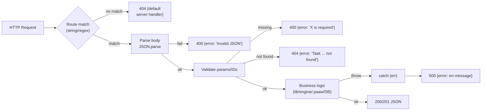

# Error Code Documentation — tPAAW Server

> Code Understanding error-mapping output — regenerated 2026-10-02 (W40) from actual source scan (`packages/server/src/routes/`, `scheduler/`, `lib/`, `tools/`).
> Previous version (2026-07-13) was an empty template ("no error codes found"). This version documents the **actual** error handling in the codebase.

## Analysis Result

The codebase uses **HTTP status codes with unstructured error messages** — there is **no structured error code system** (no `code: "ERR_XXX"` fields, no error enum, no centralized error middleware).

### Universal Error Response Shape

```json
// Every error response in the codebase follows this pattern:
HTTP/1.1 <status>
Content-Type: application/json

{ "error": "<human-readable message>" }
```

Implemented via two idioms:

```js
// Idiom 1 — direct (most routes)
res.writeHead(404, { "Content-Type": "application/json" });
res.end(JSON.stringify({ error: `Task ${id} not found` }));

// Idiom 2 — helper (some routes)
_json(res, 500, { error: err.message });
sendJSON(500, { error: err.message });
```

## HTTP Status Usage Map (measured from source)

| Status | Count | Meaning in this codebase | Typical trigger | Example sites |
|--------|-------|--------------------------|-----------------|---------------|
| 400 | 212 | Bad request: invalid JSON body, missing required field, invalid parameter | `JSON.parse` failure; missing `path` query param | coding-tasks.mjs, notes.mjs, workflow.mjs |
| 404 | 124 | Not found: task/skill/note/backup/file does not exist | Lookup by ID returns null | coding-tasks.mjs, coding-evidence.mjs, skill.mjs |
| 500 | 204 | Internal: uncaught exception, filesystem/DB failure, LLM upstream error | `catch (err)` fallback | nearly every route |
| 409 | 4 | Conflict: resource already exists / concurrent state | duplicate creation | scattered |
| 413 | 3 | Payload too large | oversized upload | uploads/notes image |
| 403 | 3 | Forbidden: path safety / security policy rejection | path traversal blocked (F-021), policy pipeline (F-022) | coding-security, security/* |
| 401 | 1 | Unauthorized | provider auth failure | provider-related route |
| 405 | 1 | Method not allowed | wrong verb on known path | a2a.mjs |
| 502 | 1 | Bad gateway | upstream proxy failure | api-tester proxy |

Total measured: ~553 explicit `writeHead`/`json`/`sendJSON` error calls (273× 4xx + 163× 5xx via writeHead alone; remainder via helpers).

## Error Handling Flow (actual)



Key observations:

1. **No global error middleware** — each route wraps its own `try/catch` and responds individually
2. **`err.message` passthrough** — 500 responses leak raw exception messages to clients (acceptable for a local-first dev tool; flagged below as an improvement item)
3. **Path-safety errors (403)** — concentrated in `lib/coding-security.mjs` (F-021: ID sanitization, path traversal protection, conversation sanitization) and `lib/security/policy-pipeline.mjs` (F-022)
4. **No structured retry semantics** — 429/503 are never used; LLM retry/backoff is handled internally in `lib/llm-utils.mjs` (F-010) before the HTTP layer sees an error

## Common Error Scenarios → Recovery (runbook-style)

| # | Scenario | Status | Message pattern | Recovery |
|---|----------|--------|-----------------|----------|
| 1 | Request body not valid JSON | 400 | `Invalid JSON` | Check `Content-Type: application/json`; ensure body is serialized |
| 2 | Missing required param | 400 | `Missing 'path' query parameter`, `parentId and subTasks[] are required` | Read endpoint docs in `specs/api-contract.md`; include all required fields |
| 3 | Resource ID not found | 404 | `Task ${id} not found`, `Plan not found: ${planId}` | Verify ID via list endpoint first (`GET /api/coding-tasks`, `/api/skills`) |
| 4 | Path outside allowed root | 403 | path-safety rejection | Use paths relative to project root; see F-021 `coding-security.mjs` |
| 5 | Filesystem / DB failure | 500 | raw `err.message` (e.g. `ENOENT`, `SQLITE_*`) | Check server console log (`data/logs/`); verify `.paaw/` or `data/paaw.db` exists |
| 6 | LLM call failure surfaced | 500 | fetch/timeout/401 message from provider | Check `data/llm-logs/{date}.jsonl` (ADR-010) for the paired call entry; verify provider config via `/api/ai-settings` |
| 7 | Upload too large | 413 | size limit message | Reduce payload or raise limit in uploads route |
| 8 | Duplicate resource | 409 | already exists | Fetch existing record; use PUT/PATCH instead of POST |

**Debugging order for any 5xx:** server console output → `data/llm-logs/` (if LLM-related) → `data/logs/agent-console/` (if agent-run) → route file `catch` block for the failing endpoint (path → route file mapping in `specs/api-contract.md`).

## Gaps & Improvement Recommendations

| Gap | Status | Impact |
|-----|--------|--------|
| Structured error codes (`code` field) | ❌ Not implemented | Clients cannot branch on machine-readable codes; UI shows raw strings |
| Centralized error middleware | ❌ Not implemented | Repetitive per-route try/catch; inconsistent messages possible |
| 500 leaks `err.message` | ⚠️ By design (local tool) | Fine for local-first tool; sanitize if ever exposed on network |
| No 429/503 rate limiting | ⚠️ None | Single-user local tool — acceptable; revisit if multi-user |
| Runbook files per error class | ❌ Not created | This file's "Scenarios → Recovery" table serves as the interim runbook |

**Proposed future format** (not yet adopted): add `code` to error bodies — `{ "error": "...", "code": "TASK_NOT_FOUND" }` — introduced incrementally in new routes without breaking existing clients (additive field). Decision belongs to the Architect; this file will be regenerated when adopted.

## Where Errors Live in Code

| Location | Role | Feature |
|----------|------|---------|
| `packages/server/src/routes/*.mjs` | Per-endpoint try/catch + status responses | all API features |
| `packages/server/src/lib/coding-security.mjs` | 403 path-safety rejections | F-021 |
| `packages/server/src/lib/security/policy-pipeline.mjs` | Policy-driven approvals/rejections | F-022 |
| `packages/server/src/lib/llm-utils.mjs` | Retry/backoff before surfacing LLM errors | F-010 |
| `packages/server/src/paaw-server.mjs` | Default 404 + crash logging (flight-recorder) | F-001 |

---
*Generated: 2026-10-02 (ISO week 40) · Source of truth: `packages/server/src/` · Companion docs: `specs/api-contract.md`, `project/ARCHITECTURE.md`*
