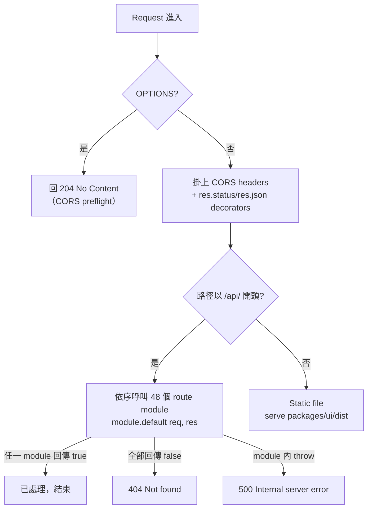

# F-001 — PAAW Server Core & HTTP Entrypoint

> 入門說明文件 · Feature: [F-001] PAAW Server Core & HTTP Entrypoint
> 對應程式碼：`packages/server/src/paaw-server.mjs` 及其 4 個核心子模組
> 最後更新：2026-10-02（TASK-043）

---

## 1. 專案簡介

F-001 是 PAAW（Personal AI Assistant Workspace）的 **Node.js HTTP server 入口模組**。它不含任何業務邏輯，只負責四件事：

1. **啟動與監聽** — 建立 HTTP server、載入所有 route 模組、啟動 WebSocket 與 scheduler
2. **請求分派（dispatch）** — 依序將每個進來的請求交給 48 個 route 模組嘗試處理
3. **防護基礎設施** — CORS、EPIPE guard、crash log、flight recorder（黑盒子 heartbeat）
4. **靜態檔案服務** — 對非 `/api/` 的 GET 請求回傳前端 `packages/ui/dist` 的打包產物

本 feature 由 5 個程式檔組成：

| 檔案 | 行數概略 | 職責 |
|---|---|---|
| `packages/server/src/paaw-server.mjs` | ~410 | 主入口：`createServer`、路由分派、CORS、靜態檔案、EADDRINUSE 處理、console log tee |
| `packages/server/src/routes/shared.mjs` | ~230 | 共用常數與工具：`PORT` / `PAAW_ROOT` 等路徑常數、`.env` 載入、`readBody` / `json` / `buildTree` / `startWatcher` 等 helpers（所有 route 模組統一從此 import，無循環依賴） |
| `packages/server/src/websocket/ws-handler.mjs` | ~500 | 獨立 WebSocket server（預設 port 4098）：PTY terminal session、PAAW Agent Loop mode、斷線 session resume |
| `packages/server/src/lib/epipe-guard.mjs` | ~10 | EPIPE 防護 — 必須是 `paaw-server.mjs` 的**第一個 import**（ESM static import 早於 module body 執行，確保在任何 `console.log` 前生效） |
| `packages/server/src/lib/flight-recorder.mjs` | ~45 | 黑盒子 heartbeat：BOOT/EXIT/SIGTERM/SIGINT 事件 + 每 30 秒記錄 heap/rss，用於診斷「無聲死亡」 |

> 歷史：`paaw-server.mjs` 原為 4620 行的 monolith，重構後約 410 行（dispatch + listen），所有路由邏輯移至 `./routes/*.mjs`、WebSocket 移至 `./websocket/`、cron 移至 `./scheduler/`。

---

## 2. 啟動方式

### 2.1 開發模式（UI + API 一起跑）— 最常用

```bash
# 在 repo 根目錄（package.json 所在）
npm run dev
```

此指令以 `concurrently` 同時啟動兩個 workspace：

- **UI**（`@paaw/ui`，Vite dev server）— 開發時走 Vite proxy，API 請求轉發到 server
- **API**（`@paaw/server`）— 實際執行 `node src/paaw-server.mjs`

### 2.2 只跑 API server

```bash
npm run dev:server
```

等同在 `packages/server` 內執行 `npm run dev -w @paaw/server` → `node src/paaw-server.mjs`。適合前端已由 Vite 獨立運行、只想重啟後端的情境。

### 2.3 生產模式

```bash
npm run build   # 打包前端到 packages/ui/dist
npm start       # node src/paaw-server.mjs（同一支程式，serve 靜態檔）
```

生產模式下 server 會直接從 `packages/ui/dist` 回傳前端頁面（見 §4 static 說明）。

### 2.4 其他相關指令

| 指令 | 說明 |
|---|---|
| `npm run dev:ui` | 只跑前端 Vite dev server |
| `npm run dev:alt` | 替代開發組合（`vite --mode dev` + `node scripts/dev-server.mjs`） |
| `npm test` | 執行 vitest（含本 feature 的 `tests/unit/server-entrypoint.test.mjs`，17 tests） |
| `npm run check:imports` | 啟動前驗證所有關鍵 import（`--strict` 模式，見 ADR-011） |

### 2.5 Port 與環境變數

- **HTTP port**：`PAAW_PORT` 環境變數，預設 **4097**（定義於 `routes/shared.mjs:84`）
- **WebSocket port**：`PAAW_WS_PORT` 環境變數，預設為 HTTP port + 1 → **4098**

`.env` 載入順序（無外部依賴，`shared.mjs` 自行實作）：

1. `PAAW_ENV` 有設 → `repo-root/.env.dev` 或 `.env.prod`
2. `repo-root/.env`
3. `process.cwd()/.env`（fallback）

> 真實環境變數**優先於** `.env` 檔內容；資料目錄可用 `PAAW_DATA_HOME` 重定向（見 `data-home.mjs`）。

### 2.6 啟動成功畫面

```
[PAAW] Tool registry initialized
[PTY-WS] WebSocket server listening on ws://127.0.0.1:4098
[PAAW] Listening on http://127.0.0.1:4097
```

若 port 被佔用會清楚報錯並退出（`EADDRINUSE` → `❌ [PAAW] Port 4097 已被佔用...`，exit code 1）。

---

## 3. HTTP 請求生命週期

每個請求進入 `paaw-server.mjs` 後依序處理：



關鍵機制：

- **Route 模組契約**：每個 route 模組 `export default async (req, res) => boolean`。回傳 `true` 表示「已處理」，回傳 `false` 傳給下一個模組。載入順序即 `ROUTE_MODULES` 陣列順序。
- **catch-all 404**：所有模組都不處理 → `404 { "error": "Not found", "path": ... }`
- **單層 try/catch**：模組內未捕捉的例外由 entrypoint 統一接住 → `500`。

---

## 4. HTTP 端點總覽

### 4.1 Entrypoint 層直接處理的行為（F-001 範圍）

`paaw-server.mjs` 本身不定義業務端點，直接處理以下三類：

| Method | Path | 說明 | 回應 |
|---|---|---|---|
| `OPTIONS` | `*`（任何路徑） | CORS preflight，直接短路返回 | `204 No Content` + CORS headers |
| `GET` | 非 `/api/`、非 `/.well-known/` 開頭路徑 | 靜態檔案服務：從 `packages/ui/dist` 回傳前端頁面與資產。檔案不存在時 fallback 回 `index.html`（SPA routing）；path traversal 由 `safeResolve` 攔截 | 檔案內容 / `404`（traversal 攔截時） |
| 任意 | 任何 `/api/` 路徑但無模組認領 | Route dispatch 的 fallback | `404 {"error":"Not found","path":"..."}` |

CORS headers（每個回應都會掛，定義於 `paaw-server.mjs`）：

```
Access-Control-Allow-Origin: *
Access-Control-Allow-Methods: GET, POST, PUT, PATCH, DELETE, OPTIONS
Access-Control-Allow-Headers: Content-Type
```

### 4.2 錯誤回應格式（統一 JSON）

| 狀態碼 | 情境 | Body 格式 |
|---|---|---|
| `404` | 無 route 模組處理此請求 | `{ "error": "Not found", "path": "<req.url>" }` |
| `500` | Route 模組拋出未捕捉例外 | `{ "error": "Internal server error", "detail": "<err.message>" }` |
| `204` | OPTIONS preflight | （空 body） |

範例 — 打一個不存在的 API：

```bash
curl -i http://127.0.0.1:4097/api/does-not-exist
# HTTP/1.1 404 Not Found
# {"error":"Not found","path":"/api/does-not-exist"}
```

### 4.3 Route 模組索引（48 模組 + scheduler）

各模組的**完整端點清單**（每個 method/path/參數/request/response schema）見 `specs/api-contract.md`。下表為入門索引 — 依功能域分組，列出模組檔與其主要 API 路徑前綴：

#### Chat / 助理核心

| 模組檔（`packages/server/src/routes/`） | 主要路徑前綴 | 功能（對應 Feature） |
|---|---|---|
| `chat.mjs` | `/api/paaw/chats/` | 對話 CRUD、模型設定（F-011） |
| `assistant.mjs` | `/api/paaw/user`、`/api/paaw/app-rules` | 使用者設定檔、app rules（F-037） |
| `ai-settings.mjs` | `/api/ai-settings/` | Provider/agent 設定（F-037） |
| `uploads.mjs` | `/api/uploads/`、`/api/paaw-uploads/` | 檔案上傳 |
| `distill.mjs` | `/api/distill/` | 知識蒸餾（F-042） |

#### Skills / Apps / Workflow

| 模組檔 | 主要路徑前綴 | 功能 |
|---|---|---|
| `skill.mjs` | `/api/skills`、`/api/paaw/skills/` | Skills CRUD（F-032） |
| `skills-api.mjs` | `/api/skill-builder/`、`/api/skill-lab/` | Skill builder（F-032） |
| `apps.mjs` | `/api/apps`、`/api/report-train`、`/api/report-publish` | App 建置與發佈（F-033） |
| `crew.mjs` | `/api/skill-test/`、`/api/cli-run` | AI crew 管理與 CLI 執行（F-031） |
| `workflow.mjs` | `/api/paaw/workflows`、`/api/paaw-root` | Workflow 執行（F-034） |
| `projects.mjs` | `/api/projects` | 專案管理板（F-045） |
| `mindmap.mjs` | `/api/mindmap/` | 心智圖生成（F-044） |
| `notes.mjs` | `/api/notes/` | Notes app（F-035） |
| `pocket.mjs` | `/api/notes`（session history 子集） | Pocket 與 session 歷史（F-055） |
| `backup.mjs` | `/api/backup/` | 備份還原（F-040） |
| `helpdesk.mjs` | `/api/helpdesk/` | AI 客服（F-036） |

#### Coding IDE / 專案智能

| 模組檔 | 主要路徑前綴 | 功能 |
|---|---|---|
| `coding.mjs` | `/api/coding-project`、`/api/coding-crew` | Coding IDE 核心（F-012 等） |
| `vibe-fs.mjs` | `/api/vibe-fs/list\|read\|write` | 檔案系統操作（F-012/F-046） |
| `vibe-sessions.mjs` | `/api/vibe-sessions`、`/api/vibe-chat` | Vibe session 持久化（F-047） |
| `coding-staged-changes.mjs` | `/api/coding-staged/changes` | Staged changes 視圖（F-012） |
| `coding-skill-suggest.mjs` | `/api/coding-project/skill-suggest` | Skill 建議 |
| `coding-ru-skills.mjs` | `/api/coding-project/ru-skills` | RU skills |
| `coding-error-codes.mjs` | `/api/coding-project/error-codes` | 錯誤碼查詢 |
| `coding-c4-model.mjs` | `/api/coding-project/c4-model` | C4 架構模型 |
| `coding-issues.mjs` | `/api/coding-issues` | Issue 追蹤（F-014） |
| `coding-tasks.mjs` | `/api/coding-tasks` | Task board 與 pipeline（F-015） |
| `coding-memory.mjs` | `/api/coding-memory` | Agent 記憶（F-025） |
| `coding-features.mjs` | `/api/coding-features` | Feature mapping（F-016） |
| `coding-health.mjs` | `/api/coding-health` | Code health（F-020） |
| `coding-evidence.mjs` | `/api/coding-evidence/task/`、`/plan/` | 測試證據（F-019） |
| `coding-releases.mjs` | `/api/coding-releases` | Release 管理（F-019） |
| `coding-handover.mjs` | `/api/coding-handover` | 交接包（F-026） |
| `coding-ops.mjs` | `/api/coding-ops` | Ops 與排障（F-027） |
| `coding-doc-coverage.mjs` | `/api/coding-doc/coverage`、`/undocumented` | 文件覆蓋率（F-028） |
| `release-unit.mjs` | `/api/ru` | Release Unit 智能分析（F-018） |

#### EM / Auto Dispatch

| 模組檔 | 主要路徑前綴 | 功能 |
|---|---|---|
| `coding-auto-dispatch.mjs` | `/api/coding-auto-dispatch/start`、`/preview` | 自動派工執行（F-023） |
| `coding-auto-dispatch-config.mjs` | `/api/coding-auto-dispatch/config`、`/api/cron-jobs` | 派工設定與 cron（F-023/F-039） |
| `coding-auto-dispatch-prompts.mjs` | `/api/coding-auto-dispatch/prompts` | 派工 prompts（F-023） |
| `coding-em-config.mjs` | `/api/coding-em/config` | EM 設定（F-023） |
| `coding-reports.mjs` | `/api/coding-reports/`、`/list` | Night Shift / EM 報告（F-023） |
| `execution-plan-routes.mjs` | `/api/auto-dispatch/plan/` | 執行計畫生命週期（F-024） |

#### 系統 / 記錄 / 工具

| 模組檔 | 主要路徑前綴 | 功能 |
|---|---|---|
| `a2a.mjs` | `/api/a2a/tasks`、`/api/a2a/interrupt` | Agent-to-Agent 協議（F-030） |
| `api-tester.mjs` | `/api/api-tester/collections` | API 測試器（F-048） |
| `llm-logs.mjs` | `/api/llm-logs`、`/stats` | LLM 呼叫記錄（F-041） |
| `agent-logs.mjs` | `/api/agent-logs`、`/ru-debug` | Agent 執行記錄（F-041） |
| `log-retention.mjs` | `/api/logs/retention` | 日誌保留政策（F-041） |
| `janitor.mjs` | `/api/logs/console`、`/api/janitor` | Console log 讀取、清理 |
| `browser.mjs` | `/api/browser/setup`、`/resize` | 共享瀏覽器 session（F-043） |
| `plugins.mjs` | `/api/plugins` | 插件管理（F-049） |
| `agentic-bindings.mjs` | `/api/agentic-bindings` | 工具綁定（F-049） |

#### Scheduler

| 模組檔（`packages/server/src/scheduler/`） | 說明 |
|---|---|
| `cron-jobs.mjs` | Cron 排程器：啟動時載入 `data/cron/cron-jobs.json`，定時觸發 agent 執行（F-039）。entrypoint 會自動確保 system-daily-log-purge 等 job 存在 |

---

## 5. WebSocket（port 4098）

`ws-handler.mjs` 在**獨立 port**（預設 `4097 + 1 = 4098`）建立 `WebSocketServer`，與 HTTP server 分離。兩種 session：

1. **PTY session** — Coding IDE 的 terminal。每個連線 spawn 一個 `node-pty` process，雙向串流輸出入；斷線時 kill PTY。
2. **PAAW Agent Loop mode** — 以 WebSocket 承載的 agent 對話循環（`runAgentLoop`）。斷線**不丟 session**：狀態 stash 起來，client 可帶 `resumeSessionId` 斷線重接（TTL 內有效）。

---

## 6. 可觀測性與防護（本 feature 內建）

| 機制 | 位置 | 說明 |
|---|---|---|
| **EPIPE guard** | `lib/epipe-guard.mjs` | stdout/stderr 管道斷裂時吞掉 EPIPE 錯誤，避免 crash 風暴（實例：2026-08-27 曾 2 秒生成 1878 個 crash file）。必須為第一個 import |
| **Flight recorder** | `lib/flight-recorder.mjs` → `log/server-heartbeat.log` | 每 30 秒記 heap/rss；BOOT/EXIT/SIGTERM/SIGINT 各一行。診斷「無聲死亡」：heap OOM = alive 行爬升後停止；SIGKILL = heartbeat 停止且無 EXIT 行。>1MB 自動輪替為 `.old` |
| **Crash log** | `paaw-server.mjs`（process-level） | `unhandledRejection` / `uncaughtException` 攔截後寫 crash log 再退出（Node 15+ 預設會直接終止） |
| **Console log tee** | `paaw-server.mjs` | stdout/stderr 全部 mirror 到 `log/server-console.log`（>5MB 輪替 `.old`），供 UI Terminal 頁輪詢（`GET /api/logs/console`） |
| **EADDRINUSE** | `paaw-server.mjs` | Port 佔用時清楚報錯 + exit(1)，不炸 exception 風暴 |

---

## 7. 測試

| 測試檔 | 範圍 |
|---|---|
| `tests/unit/server-entrypoint.test.mjs` | Handler 層：request routing、404/500 錯誤回應格式（17 tests，commit `09c6d6e2`） |

執行方式：

```bash
npm test                                    # 全部 vitest
npx vitest run tests/unit/server-entrypoint.test.mjs   # 只跑本 feature
```

---

## 8. 相關文件

- 完整 API contract（所有端點的 request/response schema）→ `specs/api-contract.md`
- 錯誤碼與排障 → `specs/error-codes.md`、runbook（`.paaw/` 內）
- 架構全景 → `ARCHITECTURE.md`（`.paaw/project/`）
- 相關 ADR：ADR-007（fileURLToPath 慣例）、ADR-011（startup import validation）、ADR-019（shared tool registry）
